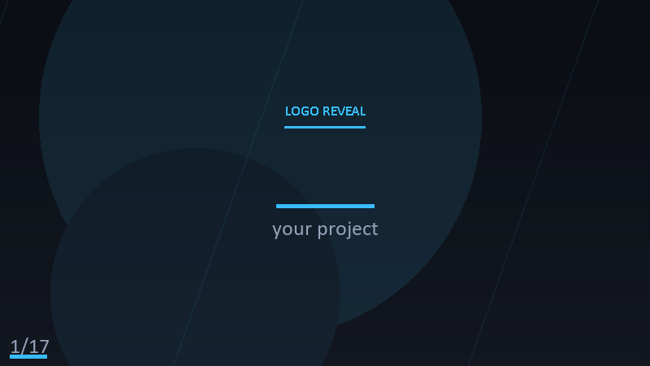

# Repo to Video Generator

A standalone, job-based video generator that turns any GitHub repository (or a local source path) into a **brag-style** promotional video: a styled "win centerpiece" that highlights the repository's biggest win, followed by a narrated scene-by-scene walkthrough of README, features, tech stack, and a call-to-action. Built as a production-style worker with a REST API, async queue, and real-time WebSocket progress streaming.

## Demo

Check out the demo to see this project in action:



*Auto-generated promotional brag animation (using premium theme)*

## Architecture

```
Client ──POST /api/videos          (enqueue job, returns job id)
         │
         ▼
   Queue (BullMQ / Redis) ──► Worker
         │                          │
         ▼                          ▼
   REST progress + Socket.IO       Storyboard ──► Script ──► TTS audio
   streaming                       + FFmpeg render
   (WebSocket)                     ──► MP4 / GIF
         │
         ▼
   video-output/<jobId>.<ext>
```

## Requirements

- **FFmpeg** (for MP4 re-encode / muxing). Install via:
  - macOS: `brew install ffmpeg`
  - Windows: install from https://ffmpeg.org/download.html and add to PATH
  - Debian/Ubuntu: `sudo apt install ffmpeg`
- **Python 3.11+**
- **Node 20+** (for the API server) — optional `python` server also supported

## Quick start (Python API server)

```bash
cd video-service
python -m venv .venv && source .venv/bin/activate
pip install -r requirements.txt
python -m src.server          # → http://127.0.0.1:8001
```

## Quick start (Node API server)

```bash
cd video-service
npm install
npm run dev                   # → http://127.0.0.1:8001
```

## Usage

```bash
# 1. Create a video job
curl -X POST http://127.0.0.1:8001/api/videos \
  -H "Content-Type: application/json" \
  -d '{"repo": "https://github.com/org/repo", "style": "brag"}'
# → { "job_id": "...", "status": "queued" }

# 2. Stream progress (Socket.IO)
#    Connect to / with token = job id, listen for "progress" events.

# 3. Poll status
curl http://127.0.0.1:8001/api/videos/<job_id>

# 4. Download result
curl -OJ http://127.0.0.1:8001/api/videos/<job_id>/file
```

### Style presets

| Style | Output | Notes |
|---|---|---|
| `brag` | Win centerpiece + narrated walkthrough + CTA | Default. Punchy, ≥30s, first-person brand voice |
| `kando` | Montage of pull requests + screenshots, no narration | Status-report style, auto-trim to ≤60s |
| `lore` | Storyboard + narration | Feature-first, ~90s |

## Jobs

| Job | Description |
|---|---|
| `repo` | A GitHub repository (slug or full URL). Fetches README, package.json/deps, Stars, open PRs. |
| `local` | A local directory path (uses its own README + subtree scan for features). |

## Quality / cost controls

- `max_minutes` — hard cap on rendered length
- `max_frames` — caps LLM storyboard candidates so rendering stays cheap
- `bitrate` — VBR target for the final MP4 (default `3500k`)
- `audio_kbps` — MP3 narration bitrate
- `frame_rate` — video output frame rate (default `24`)

## Testing

```bash
# Python
pytest

# Node
cd api && npm test
```

## Projects it maps to (from the survey)

- Section 7, project #1: **Local video studio** — built on FFmpeg (no ComfyUI dependency, runs on a single consumer GPU)
- Section 7, project #2/3: **Repo-to-video / paper-to-video explainer** — the primary generator; LLM scripts + storyboard from repo/paper content
- Section 7, project #4: **Agentic short-film generator** — the job pipeline controls director/storyboard/script/render stages, with a per-stage success/fail model and cost model

## Notes

- Open-weight models (LTX 2.5, Wan 2.2, CogVideoX, MiniMax-H3, MinWM/WorldFM) are the target inference backend when run locally; the API stays model-agnostic so you can swap the script/storyboard provider.
- `repo-video-generator/` is the CLI seed. This is the production worker/API that owns jobs, progress, and output.
